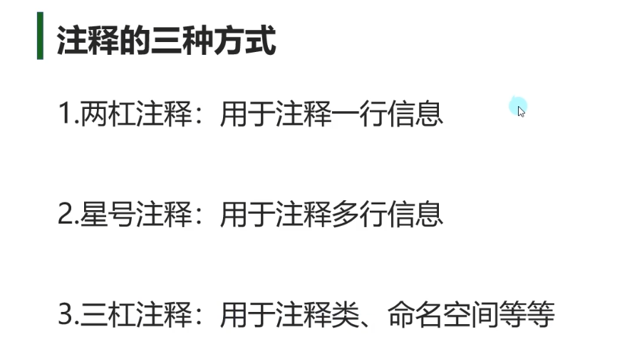
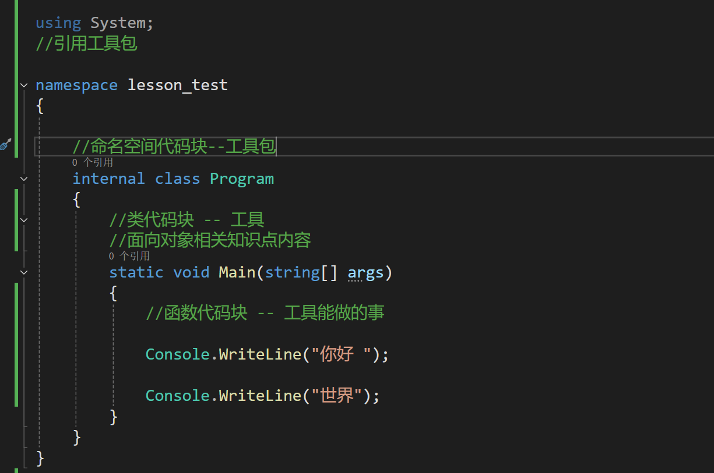
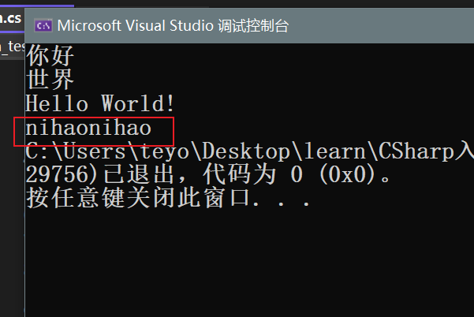

### 写代码

不停的调用系统或自定义的一些API，满足需求

### 注释

// 描述信息

/* */  

/// namespace class

### 程序文件的基础结构

### 控制台输出和学习建议

#### 输出
console.WriteLine（“***”）;
console.Write(“***”);
writeLine 和 Write （空行）

#### readline & readkey--输入
    readLine 输入多量信息
    readKey 检测是否按键，按了任意键，认为结束。