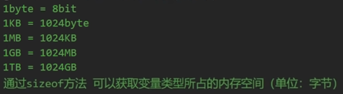
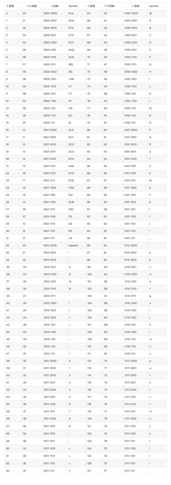
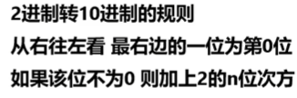
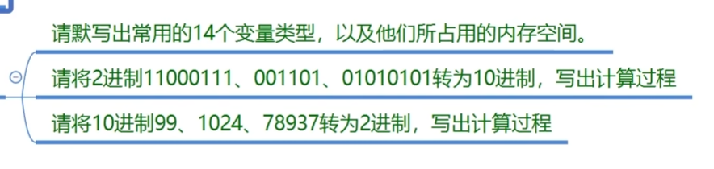
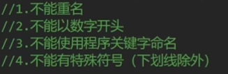

#### 1.变量的存储空间

##### 内存中：



**不能通过sizeof得到string类型所占的内存大小**
```
int charSize = sizeof(char);
Console.WriteLine(charSize);
<!-- char_size : 2 -->
```

#### 2.变量的本质 2进制

**本质：** 2进制：数据的本质都是二进制，电信号传递（只有开和关两种状态）用0和1表示。
**1bit** 表示0或1
1byte - 0000 0000

##### 2进制转换十进制

**表：**


**2转十：** 
    


**练习题**


**qes:**

有：
sbyte 1
int   1
short 2
long  8
无：
byte  1
uint  4
ushort 2
ulong 8
特殊：
bool 1
char 1
string 可变
浮点：
double 8
float  4
decimal 16

##### 变量的命名



**命名** 驼峰命名发法：第一个单词小写，之后首字母大写

**练习题**
