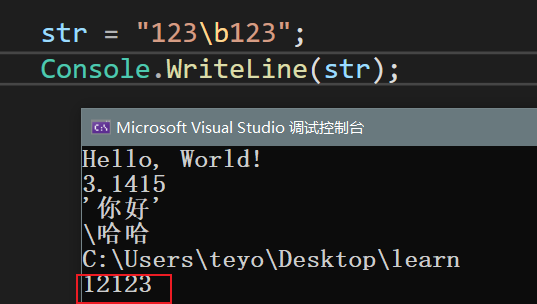
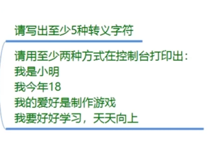

#### 常量

##### 基础语法

**关键字：** const

**固定写法** const 变量类型 变量名 = 初始值;

```
const int i = 2;
```

##### 常量特点

*声明一些常用不变的变量*

**1.必须初始化**
**2.不能被修改**
**3.在声明变量前加一个const**
**4.静态关键字**

例：PI 3.1415
```
const float PI = 3.1415f;
```

*用来计算游戏当中不会变化的变量*
*pi 角度转弧度 弧度转角度 重力加速度*
*数学计算 定理*

*玩家的最大血量不变*

#### 转义字符

##### 转义字符的使用

**什么是转义字符：**
字符串的一部分，表示一些特殊含义的字符
**字符串中的表现的，单引号，引号，空行等**

```
string  str = "ab\"cd";
```

##### 固定写法

    字符\ 

    换行符 \n

    斜杠 \\\ --- 文件路径

    制表符 \t

    光标退格 \b


    空字符 \0

    警报音 \a

**取消转义字符** 声明字符串前 + @

```
string s = @"haha\hah";
```
**qus**


