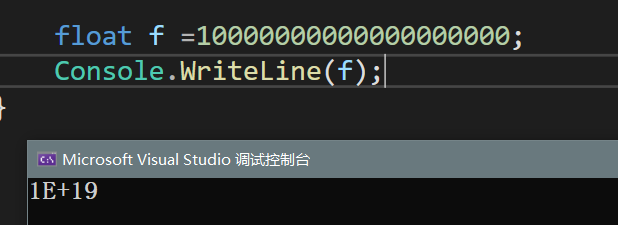
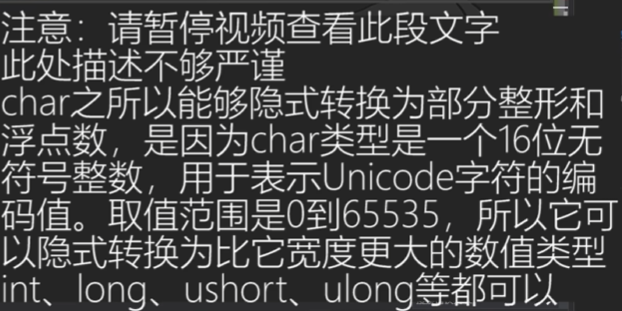
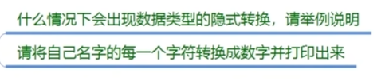

### 类型转换

#### 隐式转换

**不同变脸类型之间的相互转换**

*基本规则：* 不同类型之间自动转换 大范围转小范围

##### 相同类型之间的转换

    有符号 long -->int--> short -->sbyte

**隐式转换**  不能用小范围类型装载大范围类型

```long i = 1;
int l = 1;
short s = 1;
sbyte b = 1;

i = l; // int to long
// not to l = i;
```

    无符号ulong uint ushort byte 同理

    浮点数 decimal double float

**decimal** 不能用隐式转换的形式去存储double和float
**但是可以隐式的存储整形**

    特殊类型 bool char string   

不存在隐式转换

**double-->float-->所有整形（有符号，无符号）**
**decimal-->所有整形（有、无符号）**

##### 不同大类型之间的转换

    无符号和有符号之间

无符号装有符号:  有符号的变量不能 隐式转换为 无符号

**无符号不能装负号**

有符号装无符号： 可以装无符号变量，前提是范围覆盖，存在隐式转换

##### 浮点和整数

    浮点装整数--浮点数可以装载任何类型的整数，存在隐式转换

  
  
    整数不能隐式存储浮点数 

##### 特殊类型和其他类型

    bool没有办法和其他类型相互隐形转换

    char不能隐式存储其他类型变量，但是：


**char隐式转换成数值类型是对应的数字为一个ASCII码**      


    
总结：隐式转换规则

高精度（大范围）装低精度（小范围）
double-->float-->整数(有、无) -->char

decimal -->整数（有、无）-->char

string和bool不参与隐式转换规则

**qus**


