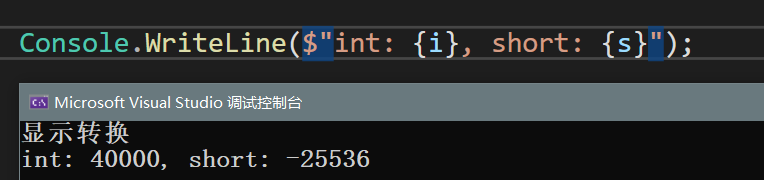
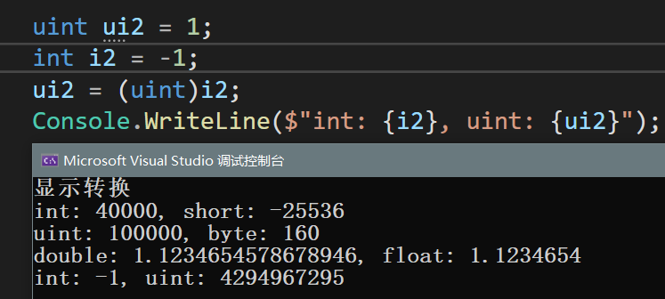
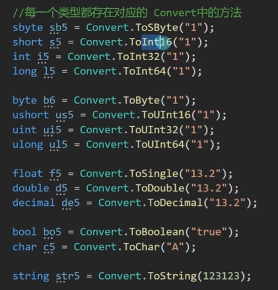

### 显示转换

手动处理 强制转换

#### 括号强转

**作用：**  将高精度类型强制转换为低精度

**语法：**  变量类型 变量名 = （变量类型）变量；

可能出现范围问题，造成的异常

```
s = (short)i;
int i = 40000;
short  s = (short)i;
```


**浮点数之间**

**double转float：** 显示为float的有效数字

**无符号和有符号**

*强转时，注意范围*



#### parse法

    作用：把字符串类型转换为对应的类型
    语法：变量类型.Parse("字符串")
    注意：字符串能够转换为对应类型

**范围必须是能够被变量存储的值**

```
Console.WriteLine(short.Parse("40000"))  // 错误，范围错误

```

*浮点数*

float和double都可以

```
Console.WriteLine(bool.Parse("true")); //True
```

#### convert法

更准确的讲各个类型之间进行转换
语法 Convert.To目标类型（）
其中的32、16等数字是由类型大小确定

**转字符串**

```
Console.WriteLine(Convert.ToInt32(1.03655)); // 1
```

精度比括号强转好 四舍五入

```
Console.WriteLine(Convert.ToInt32(true));  //1
Console.WriteLine(Convert.ToInt32(false)); //0

Console.WriteLine(Convert.ToInt32('B'));  // 66
```



#### 其他类型转string

  拼接打印
  语法：变量.toString();

```
// 进行字符串拼接时，自动调用toString方法,转成字符串
Console.WriteLine("1232" + 1 + true);
```