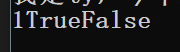

#### 算术运算符

##### 赋值符号

右侧值 赋值给左侧变量

##### 算数运算符

**+**  其他符号同理

先算右侧结果，赋值给左侧变量

连续运算，同理

#####  算数运算符优先级

*乘除取余 优先级高于 加减**

**多组括号，从里往外算*

##### 算数运算符的复合运算符

+= -= *=

*自己=自己进行运算*

```
i += 1; --> i = i+1;

```

##### 自增运算符

a++ 先用再加

++a 先加再用

*其他运算符同理*

#### 字符串拼接

##### 方式1

  +拼接

```
str += "" + 1 +2 +3 ; // 后面数字 toString

str += 1+ 2 + "" +( 3+ 4); //括号优先级，先计算优先级  拼接7
```
*注：只能单个+或 +=*


##### 方式2 

**语法：**  string.Format("代拼接内容"， 内容1，内容2，....)

想要拼接的内容用占位符替代{数字}，0~n一次往后

```
string.Format("我是{0},今年{1}岁","ty", 22);
```


##### 控制台打印拼接

*注意： 后面的内容比占位符多， 不会报错，多的内容丢失*
*后面的内容比占位符少，会报错*

```
Console.WriteLine("{0}{1}{2}",1 , true, false);
```



#### 条件运算符

**用于比较两个变量或常量**

">  == !=等"

*注意 存在两边的内容*

*必须使用比较的结果*

```
int a=1, b=2;
Console.Write(a > b);
```

**写法**

```
a > b;
a > 10;

result = a + 2 > a -3 + 2;
```
*先计算条件运算符左右，先计算，再比较*


##### 不能进行范围比较

判断是否在某两个值之间

> 1 < a < 6; //不能这样写
> 结合逻辑运算符使用
>

##### 不同类型之间的比较

**各类型均可比较**

```
int i = 3;
float  f = 3.14;

short s = 2;

result =  s < f
```

##### 特殊类型比较

*char string bool* bool和bool

**只能进行同类型比较 ==  ！=**


 